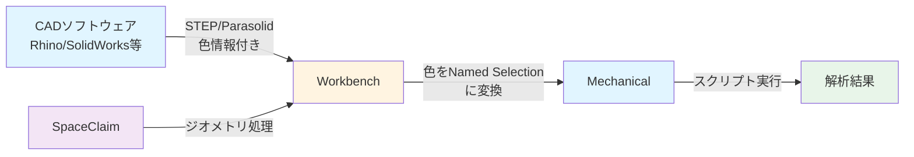
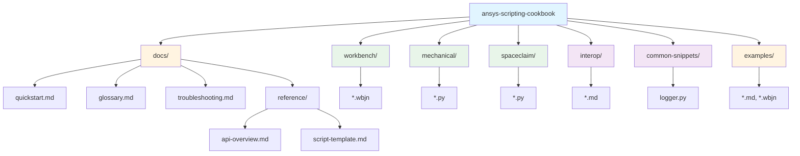
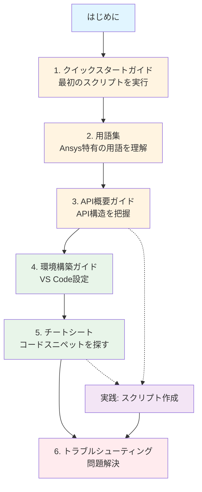

# 📘 ansys-scripting-cookbook

> Ansys製品（Workbench, Mechanical, SpaceClaim）の自動化に必要な「実用的なスクリプト（レシピ）」と「開発ノウハウ」を集約したリポジトリ。

---

## 🌟 プロジェクト概要

このリポジトリは、Ansysの内部制御（[IronPython](../docs/glossary.md#ironpython)/C#）をターゲットとした、コピー＆ペーストで即座に動くコードスニペットと、開発環境構築のベストプラクティスを提供します。

### 🎯 ターゲット
- 日々の解析業務を効率化したい現場のエンジニア
- 公式ヘルプの膨大な情報量に圧倒されているスクリプト初心者
- GUI操作の自動化（内部制御）を求めている層

### 💡 提供価値
- 実用的なコードスニペット
- [IronPython](../docs/glossary.md#ironpython) (2.7) 特有の制限や落とし穴の回避策
- ツール間（CAD → [Workbench](../docs/glossary.md#workbench) → [Mechanical](../docs/glossary.md#mechanical)）の連携テクニック

#### ツール間連携のフロー

CAD側で付けた色や属性が、Workbenchを経由してMechanicalのNamed Selectionとして自動変換され、スクリプトで利用できるようになります。

---

## 🗺️ ナビゲーションマップ

| カテゴリ | 内容 | リンク |
| :--- | :--- | :--- |
| **docs** | 📘 共通ガイド（クイックスタート、環境構築、用語集、トラブルシューティング） | [Link](./docs/) |
| **workbench** | ⚙️ [Workbench Journal](../docs/glossary.md#journal-wbjn) (.wbjn) | [Link](./workbench/) |
| **mechanical** | 🧊 Mechanical Scripting (Python) | [Link](./mechanical/) |
| **spaceclaim** | ✏️ SpaceClaim Scripting | [Link](./spaceclaim/) |
| **interop** | 🌉 ツール間連携 (The Bridge) | [Link](./interop/) |
| **common-snippets** | 💡 汎用ユーティリティ (Logging, File I/O) | [Link](./common-snippets/) |
| **examples** | 🚀 統合ワークフロー例 | [Link](./examples/) |

### プロジェクト構造

---

## 🚀 はじめに

**初めての方は、まず [クイックスタートガイド](./docs/quickstart.md) から始めてください。** 5分で最初のスクリプトを実行できます。

### 📚 学習パス

1. **[クイックスタートガイド](./docs/quickstart.md)**: 最初のスクリプトを実行してみる
2. **[用語集](./docs/glossary.md)**: Ansys 特有の用語を理解する
3. **[API 概要ガイド](./docs/reference/api-overview.md)**: API の構造と主要オブジェクトを把握する
4. **[環境構築ガイド](./docs/setup.md)**: VS CodeでIntelliSense（入力補完）を有効にする
5. **[チートシート](./docs/cheatsheet.md)**: 「〇〇したい」からコードを探す
6. **[トラブルシューティングガイド](./docs/troubleshooting.md)**: 問題が発生したら確認

### ❓ よくある質問

- **Q: Python の知識は必要ですか？**  
  A: 基本的な知識（変数、関数、ループなど）があると理解が早いですが、必須ではありません。スクリプトはコピー＆ペーストで動作します。

- **Q: どの Ansys バージョンで動作しますか？**  
  A: 各スクリプトの冒頭に動作確認バージョンが記載されています。一般的に 2023 R2 以降で動作します。

- **Q: エラーが発生したら？**  
  A: [トラブルシューティングガイド](./docs/troubleshooting.md) を確認してください。

---

## 🛠️ 技術ガイドライン

1. **言語仕様**:
   - 基本は **[IronPython](../docs/glossary.md#ironpython) 2.7** 互換で記述（`f-string`禁止、`print()`関数の括弧使用推奨）。
   - 外部ライブラリ（NumPy, Pandas等）は原則使用禁止（標準環境で動作させるため）。
2. **動作確認バージョン**:
   - スクリプト冒頭に `# Tested on Ansys 2023 R2` のように確認済みバージョンを記載。
3. **モジュール性**:
   - 1つのスクリプトで何でもやろうとせず、機能ごとにファイルを分割。
4. **前提条件**:
   - スクリプト冒頭の Docstring に、必要な [Named Selection](../docs/glossary.md#named-selection) や事前設定を明記。

---

## 🤝 コントリビューション

現在は初期構築フェーズです。バグ報告や機能リクエストは Issue で受け付けています。

---

## 📜 ライセンス

MIT License

