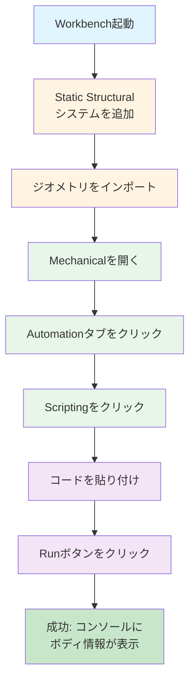
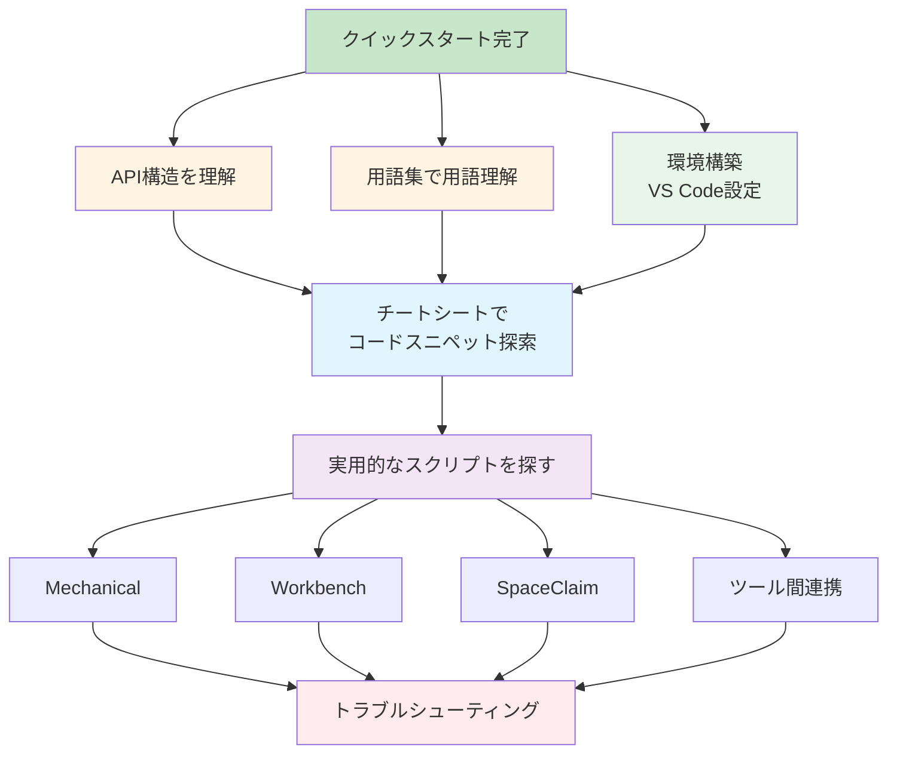

# 🚀 クイックスタートガイド

このガイドでは、初めて `ansys-scripting-cookbook` を使用する方向けに、最初の一歩を説明します。

## 📋 前提条件

### Ansys 製品のインストール

このリポジトリのスクリプトを使用するには、以下の Ansys 製品がインストールされている必要があります。

- **Ansys Workbench**（必須）
  - プロジェクト管理とシステム構築の基盤となる製品です
  - バージョン: **2023 R2 以降**を推奨（一部のスクリプトは 2022 R2 以降でも動作します）
- **Ansys Mechanical**（Mechanical スクリプトを使用する場合）
  - 構造解析の設定と実行を行う製品です
  - Workbench に含まれる **Static Structural** などのシステムで使用します
- **Ansys SpaceClaim / Discovery**（SpaceClaim スクリプトを使用する場合）
  - ジオメトリの作成・編集を行う製品です
  - 2023 R1 以降では **Ansys Discovery** として統合されています

> **注意**: 各スクリプトの冒頭には動作確認済みのバージョンが記載されています。使用するスクリプトのバージョン要件を確認してください。

### Python の知識

- **基本的な Python の知識**（推奨）
  - 変数、関数、ループなどの基本構文を理解していると理解が早いです
  - ただし、スクリプトはコピー＆ペーストで動作するため、必須ではありません
- **IronPython 2.7 の制約**
  - Ansys の内部スクリプト環境は **IronPython 2.7** です
  - `f-string` は使用できません（`.format()` を使用）
  - 詳細は [技術的な落とし穴](./reference/pitfalls.md) を参照してください

## 🎯 5分で始める

### ステップ 1: リポジトリをクローンまたはダウンロード

```bash
git clone <リポジトリURL>
cd ansys-scripting-cookbook
```

または、GitHub から ZIP ファイルをダウンロードして解凍してください。

### ステップ 2: 最初のスクリプトを実行してみる

**Ansys Mechanical の場合：**



1. Ansys Workbench を起動し、**Static Structural** などのシステムを追加します。
2. ジオメトリをインポート（または既存のプロジェクトを開く）します。
3. **Mechanical** を開きます。
4. **Automation（自動化）** タブをクリックします。
5. **Scripting（スクリプト）** をクリックしてスクリプトウィンドウを開きます。
6. 以下のコードをコピー＆ペーストして実行します：

```python
# -*- coding: utf-8 -*-
"""
最初のスクリプト: ジオメトリ情報の取得
"""
print("--- Mechanical Script: Hello World ---")

# 全ボディの取得
all_bodies = DataModel.GetObjectsByType(Ansys.ACT.Automation.Mechanical.Body)
print("Total number of bodies: {}".format(len(all_bodies)))

for i, body in enumerate(all_bodies):
    print("[{}] Body Name: {}".format(i+1, body.Name))
```

7. **Run（実行）** ボタンをクリックします。
8. コンソールにボディの情報が表示されれば成功です！

### ステップ 3: サンプルスクリプトを試す

`examples/hello_mechanical.py` を開き、その内容を Mechanical のスクリプトウィンドウに貼り付けて実行してみてください。

## 📚 次のステップ



### 1. API の構造を理解する

**[API 概要ガイド](./reference/api-overview.md)** で、Mechanical / SpaceClaim / Workbench の API 構造を把握しましょう。

### 2. 環境構築（推奨）

VS Code で入力補完を効かせたい場合は、**[環境構築ガイド](./setup.md)** を参照してください。

### 3. 用語を理解する

Ansys スクリプト開発でよく使われる用語は、**[用語集](./glossary.md)** で確認できます。

### 4. コードスニペットを探す

やりたいことからコードを探すには **[チートシート](./cheatsheet.md)** が便利です。

### 5. 実用的なスクリプトを探す

- **Mechanical の操作**: [`mechanical/`](../mechanical/) ディレクトリ
- **Workbench の操作**: [`workbench/`](../workbench/) ディレクトリ
- **SpaceClaim の操作**: [`spaceclaim/`](../spaceclaim/) ディレクトリ
- **ツール間連携**: [`interop/`](../interop/) ディレクトリ

### 6. よくある問題を確認

スクリプト実行時にエラーが出た場合は、**[トラブルシューティングガイド](./troubleshooting.md)** を参照してください。

## 💡 よくある質問

### Q: スクリプトを実行しても何も起こらない

**A:** 以下を確認してください：
- スクリプトが正しく貼り付けられているか
- エラーメッセージがコンソールに表示されていないか
- ジオメトリが正しくインポートされているか（Mechanical の場合）

### Q: `DataModel` や `Model` が定義されていないというエラーが出る

**A:** これは正常です。これらの変数は Mechanical や SpaceClaim の内部で自動的に定義されます。スクリプトは **Ansys 製品内のスクリプトウィンドウ**で実行する必要があります。VS Code から直接実行することはできません。

### Q: 日本語のコメントが文字化けする

**A:** スクリプトの1行目に `# -*- coding: utf-8 -*-` を追加してください。詳細は **[技術的な落とし穴](./reference/pitfalls.md)** を参照してください。

### Q: どのスクリプトから始めればいい？

**A:** 目的に応じて：
- **ジオメトリ操作**: `mechanical/create_named_selection.py`
- **材料割り当て**: `mechanical/batch_assign_materials.py`
- **Workbench の自動化**: `workbench/save_and_archive.wbjn`

## 🎓 学習リソース

- **[Ansys 公式ヘルプ](https://ansyshelp.ansys.com/)**: 詳細な API リファレンス
- **[ansys-stubs (GitHub)](https://github.com/ansys/ansys-stubs)**: IntelliSense 用のスタブファイル

---

[← 戻る](../README.md) | [環境構築ガイド →](./setup.md)

