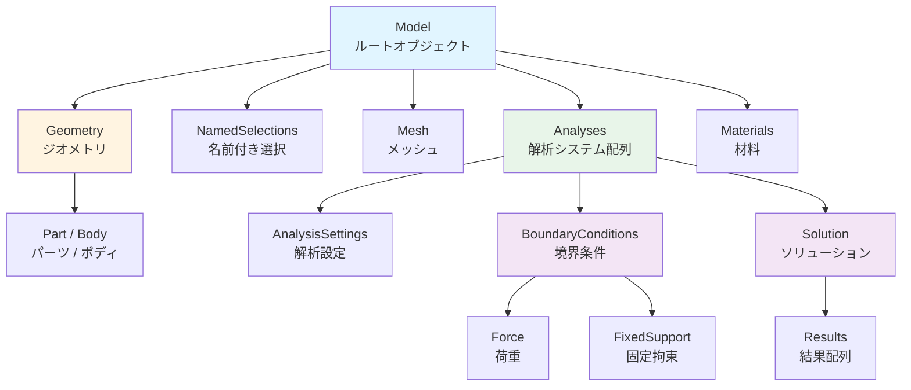
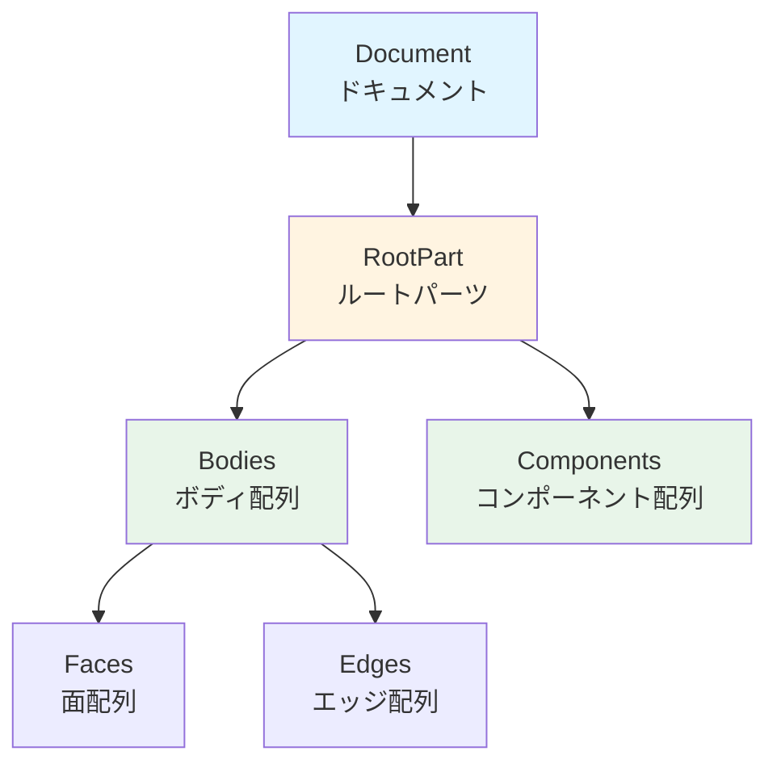
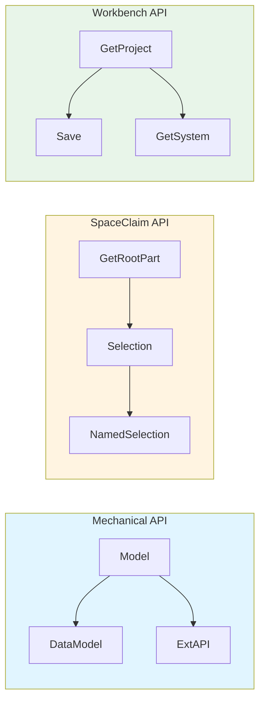
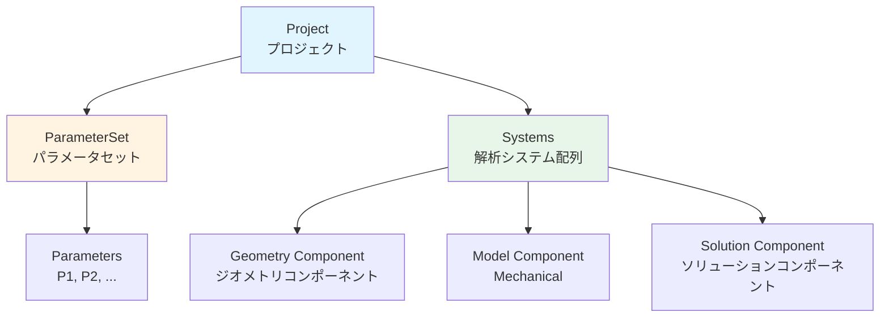

# 📚 API 構造の概要ガイド

Ansys スクリプトを書く際に理解しておくべき、各製品の API 構造と主要オブジェクトを解説します。

---

## 🎯 このガイドの目的

- **Mechanical / SpaceClaim / Workbench** の API がどのように構成されているかを理解する
- スクリプトで「何ができるか」の全体像を把握する
- 公式ヘルプを読む前の基礎知識を身につける

---

## 1. Mechanical API

Mechanical スクリプトは、解析モデルのツリー構造を操作するための API です。

### 1.1 グローバル変数

Mechanical のスクリプトウィンドウでは、以下の変数が自動的に利用可能です。

| 変数名 | 型 | 説明 |
|:---|:---|:---|
| `Model` | `Ansys.ACT.Automation.Mechanical.Model` | モデルツリーのルート。ジオメトリ、境界条件、結果などへのアクセス起点 |
| `DataModel` | `Ansys.ACT.Automation.Mechanical.DataModel` | オブジェクト検索のユーティリティ。`GetObjectsByType` など |
| `ExtAPI` | - | 拡張 API。SelectionManager などの高度な機能 |
| `Tree` | - | ツリービュー操作用オブジェクト |

### 1.2 オブジェクト階層



### 1.3 よく使うメソッド

```python
# オブジェクトを型で検索
bodies = DataModel.GetObjectsByType(Ansys.ACT.Automation.Mechanical.Body)

# オブジェクトを名前で検索
ns = DataModel.GetObjectsByName("NS_FixedFaces")[0]

# Named Selection を追加
new_ns = Model.AddNamedSelection()
new_ns.Name = "MySelection"

# メッシュサイズの変更と生成
Model.Mesh.ElementSize = Quantity("5 [mm]")
Model.Mesh.GenerateMesh()

# 解析の追加
analysis = Model.AddStaticStructuralAnalysis()

# モデルのエクスポート (CDB 形式)
analysis.ExportMechanicalData(r"C:\temp\model.cdb")

# 結果の追加
stress = analysis.Solution.AddEquivalentStress()
```

### 1.4 型の一覧（主要なもの）

| 型 | 説明 |
|:---|:---|
| `Ansys.ACT.Automation.Mechanical.Body` | ボディ |
| `Ansys.ACT.Automation.Mechanical.Part` | パーツ |
| `Ansys.ACT.Automation.Mechanical.NamedSelection` | 名前付き選択 |
| `Ansys.ACT.Automation.Mechanical.Force` | 荷重 |
| `Ansys.ACT.Automation.Mechanical.FixedSupport` | 固定拘束 |
| `Ansys.ACT.Automation.Mechanical.Results.EquivalentStress` | 相当応力 |

---

## 2. SpaceClaim API

SpaceClaim スクリプトは、3D ジオメトリの作成・編集を行うための API です。

### 2.1 グローバル変数・関数

| 名前 | 説明 |
|:---|:---|
| `GetRootPart()` | ドキュメントのルートパーツを取得 |
| `Selection` | 選択操作用のクラス |
| `NamedSelection` | Named Selection（Groups）の操作 |

### 2.2 オブジェクト階層



### 2.3 よく使うメソッド

```python
# ルートパーツの取得
root = GetRootPart()

# 全ての面を取得
all_faces = root.GetAllFaces()

# 全てのボディを取得
all_bodies = root.Bodies

# 選択の作成
selection = Selection.Create(target_faces)

# 単位の指定 (ミリメートルを内部単位のメートルに変換)
thickness = MM(2.0)

# Named Selection (Group) の作成
NamedSelection.Create(selection, "MyGroup")

# ジオメトリのインポート
options = ImportOptions.Create()
DocumentInsert.Execute(r"C:\path\to\file.step", options)
```

### 2.4 Mechanical API との違い

| 項目 | Mechanical | SpaceClaim |
|:---|:---|:---|
| 目的 | 解析設定・結果処理 | ジオメトリ作成・編集 |
| Named Selection | `Model.AddNamedSelection()` | `NamedSelection.Create()` |
| オブジェクト取得 | `DataModel.GetObjectsByType()` | `GetRootPart().Bodies` など |
| 選択操作 | `ExtAPI.SelectionManager` | `Selection.Create()` |

#### 製品間のAPI比較



各製品のAPIは異なる目的と構造を持っていますが、Workbench JournalからMechanicalスクリプトを実行することで連携できます。

---

## 3. Workbench Journal API

Workbench Journal (`.wbjn`) は、プロジェクト全体の管理・更新を行うための API です。

### 3.1 グローバル関数

| 関数 | 説明 |
|:---|:---|
| `GetProject()` | 現在のプロジェクトを取得 |
| `Save()` | プロジェクトを保存 |
| `Archive()` | プロジェクトをアーカイブ (.wbpz) |
| `GetSystem(Name="SYS")` | システムを名前で取得 |
| `UpdateAllDesignPoints()` | 全デザインポイントを更新 |

### 3.2 プロジェクト構造



### 3.3 よく使うコード

```python
# プロジェクトの取得
project = GetProject()

# パラメータセットの取得
param_set = project.GetParameterSet()

# パラメータの設定
param = param_set.GetParameter(Name="P1")
param.Expression = "100 [mm]"

# システムの取得
system = GetSystem(Name="SYS")

# コンポーネントの取得と操作
geometry = system.GetComponent(Name="Geometry")
model = system.GetComponent(Name="Model")

# Mechanical に Python スクリプトを送信 (自動連携)
model.SendCommand(Language='Python', Command="Model.Mesh.GenerateMesh()")

# Mechanical を開く
model.Edit()

# プロジェクトの保存
Save()
Save(FilePath="C:/output/project.wbpj", Overwrite=True)
```

---

## 4. 共通の注意点

### 4.1 IronPython 2.7 の制約

- `f-string` は使用不可 → `.format()` を使用
- 一部の Python 3.x 構文は動作しない
- 外部ライブラリ（numpy, pandas）は使用不可

### 4.2 単位系

- スクリプトから取得する値は、GUI の表示単位系または SI 単位系
- 明示的に単位を指定することを推奨：`"100 [N]"`

### 4.3 エラーハンドリング

```python
try:
    result = some_operation()
except Exception as e:
    print("Error: {}".format(e))
```

---

## 5. 次のステップ

- **[スクリプトテンプレート](./script-template.md)**: 実際にスクリプトを書く際の構成
- **[デバッグガイド](./debugging.md)**: エラー発生時の調査方法
- **[チートシート](../cheatsheet.md)**: よく使うコードの逆引き

---

[← 戻る](../README.md)

