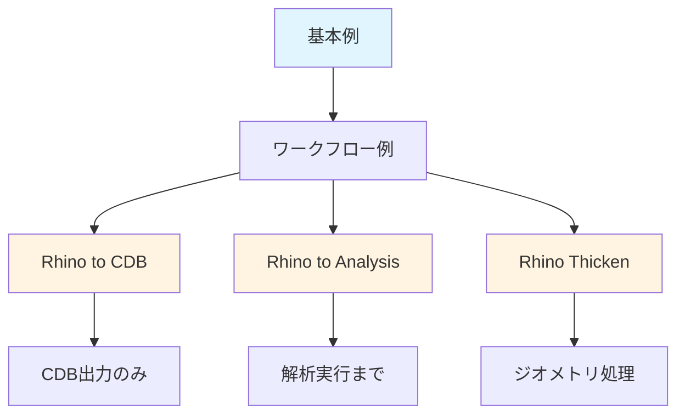

# 🚀 統合サンプル (Examples)

複数の製品や工程を跨ぐ、より実戦的で統合的なワークフローの例を掲載します。

## 🗺️ ワークフローの全体像

このディレクトリには、以下のような段階的なワークフローが含まれています：

### ワークフローの位置づけ

1. **基本例** (`hello_mechanical.py`)
   - 初心者向けの最もシンプルな例
   - Mechanical API の基本操作を学ぶ

2. **Rhino to CDB ワークフロー**
   - **目的**: CAD の色情報を利用してメッシュ制御を行い、CDB 形式でエクスポート
   - **対象**: MAPDL での解析を予定している場合
   - **ファイル**: `rhino_to_cdb_workflow.md`, `rhino_step_to_cdb.wbjn`

3. **Rhino to Analysis ワークフロー**
   - **目的**: CAD の色情報を利用してメッシュ制御と荷重設定を行い、解析まで実行
   - **対象**: Workbench 内で完結させたい場合
   - **ファイル**: `rhino_to_analysis_pipeline.md`, `rhino_to_analysis.wbjn`
   - **関連**: CDB ワークフローの拡張版（解析実行まで追加）

4. **Rhino Thicken ワークフロー**
   - **目的**: Rhino のシェルモデルを SpaceClaim で厚み付けしてソリッド化
   - **対象**: シェルモデルをソリッドモデルに変換したい場合
   - **ファイル**: `rhino_thicken_workflow.wbjn`

### ワークフロー間の関係

- **CDB ワークフロー** と **Analysis ワークフロー** は、同じ「色ベースの属性付与」という手法を使用していますが、出力先が異なります
- **Analysis ワークフロー** は **CDB ワークフロー** の機能に加えて、解析実行までを含みます
- どちらのワークフローも、Rhino での色付け → Workbench 設定 → Mechanical スクリプト実行という流れは同じです

## 📋 サンプル一覧

### 基本例

- **[hello_mechanical.py](./hello_mechanical.py)**: Mechanical スクリプトの最も基本的な構成例。
  - ジオメトリ情報の取得方法
  - `DataModel.GetObjectsByType` の使い方
  - エラーハンドリングの基本

### ワークフロー例

- **[workflow_step_to_cdb.wbjn](./workflow_step_to_cdb.wbjn)**: STEP インポートからメッシュ作成、CDB エクスポートまでを一括自動化する Workbench ジャーナル。
- **[rhino_to_cdb_workflow.md](./rhino_to_cdb_workflow.md)**: Rhino で色付けした面を自動認識し、特定部位のメッシュ制御から CDB 出力までを行うエンドツーエンドの解説。
- **[rhino_step_to_cdb.wbjn](./rhino_step_to_cdb.wbjn)**: 上記のワークフローを自動実行する Workbench ジャーナルファイル。
- **[rhino_to_analysis_pipeline.md](./rhino_to_analysis_pipeline.md)**: Rhino の色情報を「メッシュ細密化」と「荷重条件」に自動変換し、解析実行までを行うエンドツーエンドの解説。
- **[rhino_to_analysis.wbjn](./rhino_to_analysis.wbjn)**: Rhino モデルの読み込みから解析実行までを自動化する Workbench ジャーナル。
- **[rhino_thicken_workflow.wbjn](./rhino_thicken_workflow.wbjn)**: Rhino のシェルを SpaceClaim で厚み付けしてソリッド化し、STEP で再出力する自動化スクリプト。

## 🎯 使い方

1. **Ansys 製品を起動**（Mechanical, SpaceClaim, Workbench など）
2. **スクリプトウィンドウを開く**
   - Mechanical: **Automation** タブ → **Scripting**
   - SpaceClaim: **Design** タブ → **Script**
   - Workbench: **File** → **Scripting** → **Run Script File...**
3. **サンプルコードをコピー＆ペースト**
4. **実行**

詳細は [クイックスタートガイド](../docs/quickstart.md) を参照してください。

## 💡 学習のヒント

- 各サンプルには詳細なコメントが含まれています。コメントを読みながら動作を理解しましょう。
- サンプルコードを少し変更して、動作を確認してみてください。
- エラーが発生した場合は [トラブルシューティングガイド](../docs/troubleshooting.md) を参照してください。

## 🔗 関連ドキュメント

- [クイックスタートガイド](../docs/quickstart.md)
- [用語集](../docs/glossary.md)
- [トラブルシューティングガイド](../docs/troubleshooting.md)
