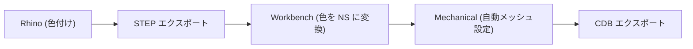

# 🦏 Rhino から CDB 出力までのエンドツーエンド自動化

Rhino で作成したモデルに色を付け、それをトリガーにして Mechanical で自動メッシュ制御・[CDB](../docs/glossary.md#cdb) 出力を行う一連のワークフローを解説します。

> **用語**: [CDB](../docs/glossary.md#cdb) (Common Database) は、MAPDL で使用する解析モデルファイル形式です。メッシュ、境界条件、材料情報を含みます。

## 1. ワークフロー概要



## 2. 各工程の手順

### ステップ 1: Rhino での準備
1.  メッシュ密度を細かくしたい面を選択します。
2.  その面の **Display Color (表示色)** を「赤 (RGB: 255, 0, 0)」に設定します。
3.  `File > Export Selected` で **STEP** 形式で保存します。

### ステップ 2: Workbench の設定
STEP ファイルの色情報を [Named Selection](../docs/glossary.md#named-selection) として読み込むための設定を行います。

1.  Workbench の **Geometry** コンポーネントを選択します。
   - プロジェクトツリー（左側のパネル）で **Geometry** コンポーネントをクリックして選択します
2.  **Properties** パネル（または Details view）で以下を設定します。
   - **Properties** パネルは、Geometry コンポーネントを選択した状態で、画面下部または右側に表示されます
   - **Named Selections**: `Yes` に設定（チェックボックスにチェックを入れる）
   - **Named Selection Key**: `Color` と入力
   - これにより、STEP ファイルの色情報が `Color:255.0.0` のような形式の Named Selection として自動的にインポートされます

### ステップ 3: Mechanical での自動処理

Mechanical を開き、以下のスクリプトを実行します。

1. **Mechanical を開く**
   - Workbench のプロジェクトツリーで **Model** コンポーネントを右クリック → **Edit** を選択
   - または、**Model** コンポーネントをダブルクリック

2. **スクリプトウィンドウを開く**
   - **Automation（自動化）** タブをクリック
   - **Scripting（スクリプト）** ボタンをクリックしてスクリプトウィンドウを表示

3. **スクリプトを実行**
   - 以下のスクリプトをコピー＆ペースト
   - **Run（実行）** ボタンをクリック

以下のスクリプトを実行することで、特定の色（赤）が付いた面を自動で探し、細密メッシュを適用して [CDB](../docs/glossary.md#cdb) を出力します。

```python
# Mechanical Script
import os

def run_automated_workflow():
    # 1. 赤色 (RGB: 255, 0, 0) に対応する名前付き選択を検索
    # Workbench の設定により "Color:255.0.0" のような名前でインポートされます
    # すべての Named Selection を取得
    all_ns = DataModel.GetObjectsByType(Ansys.ACT.Automation.Mechanical.NamedSelection)
    # 名前の中に "255.0.0" を含む Named Selection を検索（赤色に対応）
    target_ns = [ns for ns in all_ns if "255.0.0" in ns.Name]
    
    if not target_ns:
        print("指定された色の面が見つかりませんでした。")
        return
    
    ns = target_ns[0]
    print("Found Named Selection: " + ns.Name)

    # 2. メッシュサイズの設定 (0.5mm)
    sizing = Model.Mesh.AddSizing()
    sizing.Location = ns
    sizing.ElementSize = Quantity("0.5 [mm]")
    sizing.Name = "Sizing_From_Rhino_Color"

    # 3. メッシュ生成
    Model.Mesh.GenerateMesh()

    # 4. CDB エクスポート
    # デスクトップのパスを取得
    desktop = os.path.join(os.environ["USERPROFILE"], "Desktop")
    # 出力ファイルパスを設定（必要に応じて変更してください）
    export_path = os.path.join(desktop, "output_from_rhino.cdb")
    
    # 解析システムを取得（最初の解析システムを使用）
    analysis = Model.Analyses[0]
    # CDB 形式でエクスポート（メッシュ、境界条件、材料情報を含む）
    analysis.ExportMechanicalData(export_path)
    print("CDB exported to: " + export_path)

run_automated_workflow()
```

## 3. この手法のメリット

- **GUI 操作の排除**: CAD 側で色を付けるだけで、Mechanical 側でのクリック操作なしに特定の部位を制御できます。
- **再現性**: モデルの形状が変更されても、色が同じであればスクリプトはそのまま動作します。
- **標準化**: 「赤はメッシュ細密化」「青は固定拘束」のようにチーム内でルール化することで、解析作業の自動化が進みます。

---
[← 戻る](./README.md)

