# 🌉 STEP の色・レイヤーによる Named Selection 自動化

CAD 側（CATIA, NX, SolidWorks 等）で部品や面に付けた「色」や「レイヤー」を Mechanical の Named Selection に自動変換するテクニックを解説します。

## 1. なぜこの「裏技」が必要か？

通常、STEP インポートでは CAD 側の名前（Body Name）は引き継げますが、面（Face）レベルの選択セットを維持するのは困難です。
しかし、**SpaceClaim のスクリプト機能** を介することで、特定の色が付いた面を抽出して Named Selection に変換し、それを Mechanical へ渡すことができます。

## 2. ワークフロー

```mermaid
graph LR
    CAD[CAD: 色付け] --> STEP[STEP 出力]
    STEP --> SC[SpaceClaim: スクリプト実行]
    SC --> NS[Named Selection 作成]
    NS --> MECH[Mechanical: 境界条件の自動割当]
```



## 3. SpaceClaim スクリプト例

以下のスクリプトを SpaceClaim で実行すると、赤い面（RGB: 255, 0, 0）をすべて選択し、"NS_Load_Face" という名前の Named Selection を作成します。

```python
# SpaceClaim Script: Color to Named Selection
import SpaceClaim.Api.V19.Modeler as Modeler

def create_ns_by_color(r, g, b, ns_name):
    # すべての面を探索
    all_faces = GetRootPart().GetAllFaces()
    target_faces = []
    
    for face in all_faces:
        color = face.Color
        if color.R == r and color.G == g and color.B == b:
            target_faces.append(face)
            
    if target_faces:
        # 選択セットを作成
        selection = Selection.Create(target_faces)
        # Named Selection (Group) を作成
        NamedSelection.Create(selection, ns_name)
        print("Created NS: {} with {} faces".format(ns_name, len(target_faces)))

# RGB(255, 0, 0) = 赤色 の面を NS_Load_Face に変換
create_ns_by_color(255, 0, 0, "NS_Load_Face")
```

## 4. Mechanical 側での利用

上記で作成された "NS_Load_Face" は、Mechanical にインポートした際に自動的に Named Selection として認識されます。
これを利用して、Mechanical スクリプト側で荷重を割り当てることができます。

```python
# Mechanical Script
ns = DataModel.GetObjectsByName("NS_Load_Face")[0]
force = Model.Analyses[0].AddForce()
force.Location = ns
```

## 5. ベストプラクティス

- **CAD 側での運用ルール**: 「固定面は青(0,0,255)」「荷重面は赤(255,0,0)」のように色と意味を標準化しておくと、完全自動解析が実現します。
- **Parasolid の利用**: STEP よりも Parasolid (`.x_t`) の方が色が安定して保持される場合があります。

---
[← 戻る](../README.md)

