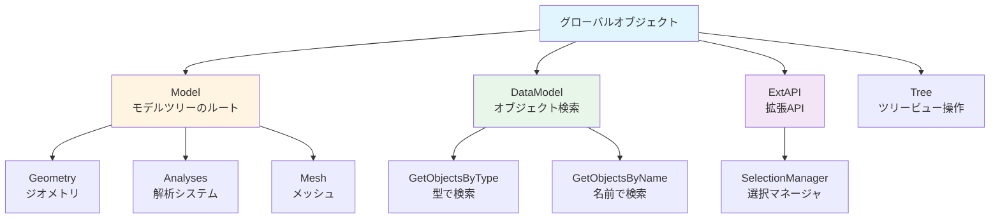

# 🧊 Mechanical スクリプト (Python)

Ansys Mechanical (Simulation) の操作を自動化するためのスクリプト群です。

## 🏗️ Mechanical API の基礎

Mechanical スクリプト（ACT）で最も頻繁に使用するグローバルオブジェクトです。



| オブジェクト | 説明 |
| :--- | :--- |
| `Model` | モデルツリー全体のルート。`Model.Geometry` や `Model.Analyses` へアクセス。 |
| `DataModel` | オブジェクトの検索・管理。`DataModel.GetObjectsByType()` が強力。 |
| `ExtAPI` | 拡張 API。選択マネージャ (`SelectionManager`) や GUI 操作に使用。 |
| `Tree` | ツリービューの操作（フィルタリングや選択状態の変更など）。 |

## 💡 よく使うパターン

### 1. オブジェクトの検索
```python
# 全てのボディを取得
bodies = DataModel.GetObjectsByType(Ansys.ACT.Automation.Mechanical.Body)

# 名前でオブジェクトを検索
fixed_support = [obj for obj in DataModel.AllObjects if obj.Name == "Fixed Support"][0]
```

### 2. 単位を考慮した値の設定
```python
# Quantity クラスを使用して単位付きで設定
force.Magnitude.Output.SetData("100 [N]")
```

### 3. メッシュの生成と解析実行
```python
# メッシュ生成
Model.Mesh.GenerateMesh()

# 解析実行
Model.Analyses[0].Solve(True)
```

### 典型的なワークフロー


## 📂 セクション

- **[ジオメトリ](./geometry.md)**: ジオメトリの操作、Named Selection の作成など。
- **[メッシュ](./mesh.md)**: メッシュサイズの設定、ローカルサイズコントロール。
- **[境界条件](./boundary-cond.md)**: 境界条件の設定、材料の割り当て。
  - **[batch_assign_materials.py](./batch_assign_materials.py)**: ボディ名に基づいた材料の一括割り当て。
- **[後処理](./post-processing.md)**: 結果の抽出、レポート作成。
  - **[simple_export.py](./simple_export.py)**: 最大応力値などのテキスト書き出し。

## 🚀 実行方法

Mechanical 内の **Automation (自動化)** タブ -> **Scripting (スクリプト)** ウィンドウにコードを貼り付けて実行してください。
詳細は [環境構築ガイド](../docs/setup.md) を参照してください。

## ⚠️ Tips
- **パフォーマンス**: 大規模モデルでは `DataModel.GetObjectsByType()` をループ内で多用せず、一度変数に格納してください。
- **APIリファレンス**: 詳細は [API 概要ガイド](../docs/reference/api-overview.md) を参照してください。

## 🔗 関連ドキュメント

- **[クイックスタートガイド](../docs/quickstart.md)**: 初めてのスクリプト実行
- **[用語集](../docs/glossary.md)**: Ansys スクリプト開発でよく使われる用語
- **[チートシート](../docs/cheatsheet.md)**: 「〇〇したい」からコードを探す
- **[トラブルシューティング](../docs/troubleshooting.md)**: よくあるエラーと解決方法

---

[← 戻る](../README.md)
